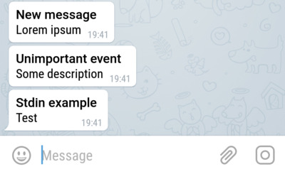

# Notify Send Telegram


Send notifications to your phone/desktop instantly via the fastest cross-platform messenger. Can be used as an email notifications replacement, as a reminder (with `cron`), and even as a log monitor (see `examples/syslog-monitor.sh`).

## Disclaimer

This script **does not** use `notify-send` GNU/Linux utility and even **does not interact** with it. But it uses common syntax for sending notification: `nst 'Title' 'Body'` vs `notify-send 'Title' 'Body'`.

## Requirements

- Python 3 and pip3
- `requests` python module (see below)

Only for user: `pip3 install --user requests`

System-wide: `sudo -H pip3 install requests`

## How to use

See [requirements](#requirements) for environment information

1. Create your bot via [Bot Father](https://t.me/BotFather) and copy _token_ of your bot
2. Get your _user id_ via [@get_id_bot](https://t.me/get_id_bot)
3. Press "Start" button to give your bot permission to send messages
4. Start script: `./notify-send-telegram.py -t YOUR_TOKEN -r USER_ID 'Hello world'`
5. Add system-wide symlink (optional): `sudo ln -s $(pwd)/notify-send-telegram.py /usr/local/bin/nst`

You will get 'Hello world' message from your bot. Token and user id will be saved to config file. If you want to override them, just add option `--save`.

## Examples

- Just message with title and body: `nst 'New message' 'Lorem ipsum'`
- Message without sound: `nst --silent 'Unimportant event' 'Some description'`
- Read message body from stdin (pipe): `echo "Test" | nst 'Stdin example' --stdin`



## Extended documentation

```
usage: nst [options] SUMMARY [BODY]

positional arguments:
  SUMMARY               Notification title, for example 'New mail'
  BODY                  Text of notification, multi-line supported. If BODY
                        isn't set, just the SUMMARY is sent

optional arguments:
  -h, --help            show this help message and exit
  -n, --silent          send notification with no sound
  -r chat_id, --recipient chat_id
                        telegram chat_id (user_id) to send notification
  -t TOKEN, --token TOKEN
                        set telegram bot token to use
  -s, --stdin           read notification BODY from stdin
  -z, --save            save recipient & token to config file and use them as
                        defaults in future
  -w, --raw             do not escape HTML tags in body (use with caution)
```

## About

License: MIT

Made with 💚 by [Mike_Went](https://github.com/MikeWent/notify-send-telegram)
